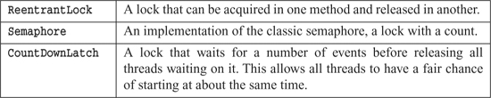
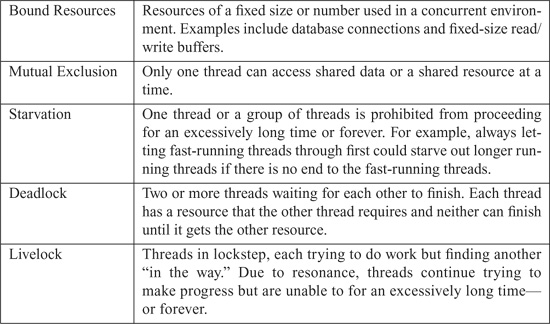

# 第 13 章 Concurrency 并发

by Brett L. Schuchert


"Objects are abstractions of processing. Threads are abstractions of schedule."

—James O. Coplien1

1. Private correspondence.

## 总结/摘要 Summary

**Concurrency** is a **decoupling strategy** that separates **what gets done** from **when it gets done**, improving throughput and system structure but introducing significant complexity. Writing **clean concurrent programs** is extraordinarily difficult—code that appears correct can fail under stress due to subtle timing issues. This chapter explores why concurrency is necessary (improving responsiveness, throughput, and enabling parallel processing), while dispelling common **myths** (concurrency doesn't always improve performance, requires fundamental design changes, and introduces complex bugs). Key **defense principles** include: following the **Single Responsibility Principle (SRP)** by separating concurrency-related code; **limiting the scope of shared data** and using **data encapsulation**; favoring **copies of data** over shared mutable state; and designing **independent threads** that act as if they exist alone. Developers must **know their libraries** (Java's thread-safe collections, executor frameworks, nonblocking solutions) and **execution models** (**Producer-Consumer**, **Readers-Writers**, **Dining Philosophers**). Critical practices include: **keeping synchronized sections small**, avoiding dependencies between synchronized methods, writing correct shutdown code, and thoroughly **testing threaded code** with strategies like treating failures seriously, testing non-threaded code first, making threaded code pluggable and tunable, running with more threads than processors, testing on different platforms, and instrumenting code to force failures. The chapter emphasizes that concurrent code requires **small, focused, thread-aware components**, thorough understanding of **shared data boundaries**, knowledge of fundamental algorithms, minimal locking with careful lock management, and extensive testing—all essential for creating systems where **concurrency concerns are cleanly separated** from business logic.

> **并发**是一种**解耦策略**，它将**要做什么**与**何时做**分离开来，提高了吞吐量和系统结构，但引入了显著的复杂性。编写**整洁的并发程序**是极其困难的——看起来正确的代码可能由于微妙的时序问题而在压力下失败。本章探讨了为什么并发是必要的（改善响应性、吞吐量和实现并行处理），同时消除常见的**神话**（并发并不总是提高性能，需要根本性的设计变更，并引入复杂的错误）。关键的**防御原则**包括：通过分离并发相关代码来遵循**单一职责原则（SRP）**；**限制共享数据的范围**并使用**数据封装**；优先使用**数据副本**而不是共享可变状态；设计**独立线程**使其表现得好像独自存在。开发人员必须**了解他们的库**（Java 的线程安全集合、执行器框架、非阻塞解决方案）和**执行模型**（**生产者-消费者**、**读者-写者**、**哲学家就餐**）。关键实践包括：**保持同步区域小**、避免同步方法之间的依赖关系、编写正确的关闭代码，以及通过诸如认真对待失败、首先测试非线程代码、使线程代码可插拔和可调优、运行比处理器更多的线程、在不同平台上测试以及检测代码以强制失败等策略来彻底**测试线程代码**。本章强调并发代码需要**小型、集中的、线程感知的组件**、对**共享数据边界**的彻底理解、基本算法的知识、最少锁定与小心的锁管理，以及广泛的测试——所有这些对于创建**并发关注点与业务逻辑干净分离**的系统都是必不可少的。

## 小结 Chapter Overview

This chapter provides a comprehensive guide to writing concurrent code cleanly and correctly. We begin by understanding **why concurrency matters**—it's a **decoupling strategy** that improves throughput and structure by separating **what** from **when**, though we must navigate **myths and misconceptions** (concurrency's performance benefits are conditional, design changes are significant, container knowledge is essential, overhead exists, complexity is high, and bugs are often sporadic). We examine the **challenges** of concurrency through a simple example showing how **12,870 different execution paths** can emerge from seemingly simple code. The **defense principles** section presents core strategies: applying **SRP** to concurrency code, **limiting data scope**, using **data copies**, creating **independent threads**, **knowing your library** (thread-safe collections, executors, nonblocking solutions), understanding **execution models** (Producer-Consumer, Readers-Writers, Dining Philosophers), **avoiding synchronized method dependencies**, **keeping synchronized sections small**, and writing **correct shutdown code**. The extensive **testing** section emphasizes treating failures seriously, separating threaded from non-threaded code, making code pluggable and tunable, running with more threads than processors, testing across platforms, and **instrumenting code** (both hand-coded and automated approaches) to expose rare concurrency bugs. Throughout, the message is clear: concurrent programming requires **rigorous discipline**, **separation of concerns**, **deep understanding of shared state**, and **extensive testing** to produce clean, correct systems.

> 本章提供了一个关于如何整洁且正确地编写并发代码的全面指南。我们首先理解**为什么并发很重要**——它是一种**解耦策略**，通过将**做什么**与**何时做**分离来改善吞吐量和结构，尽管我们必须应对**神话和误解**（并发的性能优势是有条件的，设计变更是显著的，容器知识是必不可少的，存在开销，复杂性很高，而且错误通常是零星的）。我们通过一个简单的例子来考察**并发的挑战**，显示看似简单的代码如何产生 **12,870 条不同的执行路径**。**防御原则**部分介绍了核心策略：将 **SRP** 应用于并发代码、**限制数据范围**、使用**数据副本**、创建**独立线程**、**了解你的库**（线程安全集合、执行器、非阻塞解决方案）、理解**执行模型**（生产者-消费者、读者-写者、哲学家就餐）、**避免同步方法依赖关系**、**保持同步区域小**以及编写**正确的关闭代码**。广泛的**测试**部分强调认真对待失败、将线程代码与非线程代码分离、使代码可插拔和可调优、运行比处理器更多的线程、跨平台测试，以及**检测代码**（手动编码和自动化方法）以暴露罕见的并发错误。贯穿始终的信息是明确的：并发编程需要**严格的纪律**、**关注点分离**、对**共享状态的深刻理解**以及**广泛的测试**才能产生整洁、正确的系统。

---

Writing clean concurrent programs is hard—very hard. It is much easier to write code that executes in a single thread. It is also easy to write multithreaded code that looks fine on the surface but is broken at a deeper level. Such code works fine until the system is placed under stress.

> 编写整洁的并发程序很难——非常难。编写在单个线程中执行的代码要容易得多。编写表面上看起来不错但在更深层次上存在问题的多线程代码也很容易。这样的代码工作正常，直到系统承受压力。

In this chapter we discuss the need for concurrent programming, and the difficulties it presents. We then present several recommendations for dealing with those difficulties, and writing clean concurrent code. Finally, we conclude with issues related to testing concurrent code.

> 在本章中，我们讨论并发编程的必要性及其带来的困难。然后，我们提出几条处理这些困难和编写整洁并发代码的建议。最后，我们总结与测试并发代码相关的问题。

Clean Concurrency is a complex topic, worthy of a book by itself. Our strategy in this book is to present an overview here and provide a more detailed tutorial in "Concurrency II" on page 317. If you are just curious about concurrency, then this chapter will suffice for you now. If you have a need to understand concurrency at a deeper level, then you should read through the tutorial as well.

> 整洁并发是一个复杂的主题，值得单独写一本书。本书的策略是在这里提供一个概述，并在第 317 页的"并发 II"中提供更详细的教程。如果你只是对并发好奇，那么本章现在就足够了。如果你需要更深入地理解并发，那么你也应该阅读教程。

## WHY CONCURRENCY? 为什么需要并发？

Concurrency is a decoupling strategy. It helps us decouple what gets done from when it gets done. In single-threaded applications what and when are so strongly coupled that the state of the entire application can often be determined by looking at the stack backtrace. A programmer who debugs such a system can set a breakpoint, or a sequence of breakpoints, and know the state of the system by which breakpoints are hit.

> 并发是一种**解耦策略**。它帮助我们将**要做什么**与**何时做**解耦。在单线程应用程序中，要做什么和何时做是如此紧密耦合，以至于整个应用程序的状态通常可以通过查看堆栈回溯来确定。调试这样一个系统的程序员可以设置断点或一系列断点，并通过命中哪些断点来了解系统的状态。

Decoupling what from when can dramatically improve both the throughput and structures of an application. From a structural point of view the application looks like many little collaborating computers rather than one big main loop. This can make the system easier to understand and offers some powerful ways to separate concerns.

> 将做什么与何时做解耦可以显著改善应用程序的吞吐量和结构。从结构的角度来看，应用程序看起来像许多小的协作计算机，而不是一个大的主循环。这可以使系统更容易理解，并提供一些强大的方法来分离关注点。

Consider, for example, the standard "Servlet" model of Web applications. These systems run under the umbrella of a Web or EJB container that partially manages concurrency for you. The servlets are executed asynchronously whenever Web requests come in. The servlet programmer does not have to manage all the incoming requests. In principle, each servlet execution lives in its own little world and is decoupled from all the other servlet executions.

> 例如，考虑 Web 应用程序的标准"Servlet"模型。这些系统在 Web 或 EJB 容器的保护下运行，容器部分地为你管理并发。每当 Web 请求到来时，servlet 就会异步执行。servlet 程序员不必管理所有传入的请求。原则上，每个 servlet 执行都生活在自己的小世界中，并与所有其他 servlet 执行解耦。

Of course if it were that easy, this chapter wouldn't be necessary. In fact, the decoupling provided by Web containers is far less than perfect. Servlet programmers have to be very aware, and very careful, to make sure their concurrent programs are correct. Still, the structural benefits of the servlet model are significant.

> 当然，如果真的那么容易，就不需要这一章了。事实上，Web 容器提供的解耦远非完美。Servlet 程序员必须非常警觉，非常小心，以确保他们的并发程序是正确的。尽管如此，servlet 模型的结构优势是显著的。

But structure is not the only motive for adopting concurrency. Some systems have response time and throughput constraints that require hand-coded concurrent solutions. For example, consider a single-threaded information aggregator that acquires information from many different Web sites and merges that information into a daily summary. Because this system is single threaded, it hits each Web site in turn, always finishing one before starting the next. The daily run needs to execute in less than 24 hours. However, as more and more Web sites are added, the time grows until it takes more than 24 hours to gather all the data. The single-thread involves a lot of waiting at Web sockets for I/O to complete. We could improve the performance by using a multithreaded algorithm that hits more than one Web site at a time.

> 但结构不是采用并发的唯一动机。一些系统具有响应时间和吞吐量约束，需要手工编码的并发解决方案。例如，考虑一个单线程信息聚合器，它从许多不同的网站获取信息并将这些信息合并为每日摘要。由于该系统是单线程的，它依次访问每个网站，总是在开始下一个之前完成一个。每日运行需要在不到 24 小时内完成。然而，随着越来越多的网站被添加，时间增长到超过 24 小时才能收集所有数据。单线程涉及大量在 Web 套接字等待 I/O 完成。我们可以通过使用同时访问多个网站的多线程算法来改善性能。

Or consider a system that handles one user at a time and requires only one second of time per user. This system is fairly responsive for a few users, but as the number of users increases, the system's response time increases. No user wants to get in line behind 150 others! We could improve the response time of this system by handling many users concurrently.

> 或者考虑一个一次处理一个用户并且每个用户只需要一秒钟时间的系统。这个系统对少数用户来说响应相当快，但随着用户数量的增加，系统的响应时间也增加。没有用户想排在其他 150 个人后面！我们可以通过并发处理许多用户来改善这个系统的响应时间。

Or consider a system that interprets large data sets but can only give a complete solution after processing all of them. Perhaps each data set could be processed on a different computer, so that many data sets are being processed in parallel.

> 或者考虑一个解释大型数据集但只能在处理所有数据集之后才能给出完整解决方案的系统。也许每个数据集都可以在不同的计算机上处理，以便并行处理许多数据集。

### Myths and Misconceptions 神话和误解

And so there are compelling reasons to adopt concurrency. However, as we said before, concurrency is hard. If you aren't very careful, you can create some very nasty situations. Consider these common myths and misconceptions:

> 因此，有充分的理由采用并发。然而，正如我们之前所说，并发很难。如果你不是非常小心，你可能会创造一些非常糟糕的情况。考虑这些常见的神话和误解：

- Concurrency always improves performance.
Concurrency can sometimes improve performance, but only when there is a lot of wait time that can be shared between multiple threads or multiple processors. Neither situation is trivial.

> - **并发总是提高性能。**
> 并发有时可以提高性能，但只有当存在可以在多个线程或多个处理器之间共享的大量等待时间时。这两种情况都不简单。

- Design does not change when writing concurrent programs.
In fact, the design of a concurrent algorithm can be remarkably different from the design of a single-threaded system. The decoupling of what from when usually has a huge effect on the structure of the system.

> - **编写并发程序时设计不会改变。**
> 实际上，并发算法的设计可能与单线程系统的设计显著不同。将做什么与何时做解耦通常对系统的结构有巨大影响。

- Understanding concurrency issues is not important when working with a container such as a Web or EJB container.
In fact, you'd better know just what your container is doing and how to guard against the issues of concurrent update and deadlock described later in this chapter.

> - **使用诸如 Web 或 EJB 容器之类的容器时，理解并发问题并不重要。**
> 实际上，你最好知道你的容器在做什么，以及如何防范本章后面描述的并发更新和死锁问题。

Here are a few more balanced sound bites regarding writing concurrent software:

> 以下是关于编写并发软件的一些更平衡的简短说明：

- Concurrency incurs some overhead, both in performance as well as writing additional code.
- Correct concurrency is complex, even for simple problems.
- Concurrency bugs aren't usually repeatable, so they are often ignored as one-offs2 instead of the true defects they are.

> - 并发会产生一些开销，包括性能和编写额外代码。
> - 正确的并发很复杂，即使对于简单的问题也是如此。
> - 并发错误通常不可重复，因此它们经常被忽略为一次性事件[2]，而不是真正的缺陷。

2. Cosmic-rays, glitches, and so on.

- Concurrency often requires a fundamental change in design strategy.

> - 并发通常需要设计策略的根本性变化。

## CHALLENGES 挑战

What makes concurrent programming so difficult? Consider the following trivial class:

> 是什么让并发编程如此困难？考虑以下简单的类：

```java
   public class X {
      private int lastIdUsed;

      public int getNextId() {
           return ++lastIdUsed;
       }
   }
```

Let's say we create an instance of X, set the lastIdUsed field to 42, and then share the instance between two threads. Now suppose that both of those threads call the method getNextId(); there are three possible outcomes:

> 假设我们创建一个 X 的实例，将 lastIdUsed 字段设置为 42，然后在两个线程之间共享该实例。现在假设这两个线程都调用方法 getNextId()；有三种可能的结果：

- Thread one gets the value 43, thread two gets the value 44, lastIdUsed is 44.

- Thread one gets the value 44, thread two gets the value 43, lastIdUsed is 44.

- Thread one gets the value 43, thread two gets the value 43, lastIdUsed is 43.

> - 线程一得到值 43，线程二得到值 44，lastIdUsed 是 44。

> - 线程一得到值 44，线程二得到值 43，lastIdUsed 是 44。

> - 线程一得到值 43，线程二得到值 43，lastIdUsed 是 43。

The surprising third result3 occurs when the two threads step on each other. This happens because there are many possible paths that the two threads can take through that one line of Java code, and some of those paths generate incorrect results. How many different paths are there? To really answer that question, we need to understand what the Just-In-Time Compiler does with the generated byte-code, and understand what the Java memory model considers to be atomic.

> 当两个线程相互干扰时，就会出现令人惊讶的第三个结果[3]。这是因为两个线程可以通过那一行 Java 代码采取许多可能的路径，其中一些路径会产生不正确的结果。有多少条不同的路径？要真正回答这个问题，我们需要了解即时编译器对生成的字节码做了什么，并了解 Java 内存模型认为什么是原子的。

3. See "Digging Deeper" on page 323.

A quick answer, working with just the generated byte-code, is that there are 12,870 different possible execution paths4 for those two threads executing within the getNextId method. If the type of lastIdUsed is changed from int to long, the number of possible paths increases to 2,704,156. Of course most of those paths generate valid results. The problem is that some of them don't.

> 一个快速的答案，仅使用生成的字节码，是这两个线程在 getNextId 方法中执行时有 **12,870 条不同的可能执行路径**[4]。如果将 lastIdUsed 的类型从 int 更改为 long，可能路径的数量将增加到 2,704,156。当然，这些路径中的大多数会产生有效的结果。问题是其中一些不会。

4. See "Possible Paths of Execution" on page 321.

## CONCURRENCY DEFENSE PRINCIPLES 并发防御原则

What follows is a series of principles and techniques for defending your systems from the problems of concurrent code.

> 以下是一系列用于保护你的系统免受并发代码问题影响的原则和技术。

### Single Responsibility Principle 单一职责原则

The SRP5 states that a given method/class/component should have a single reason to change. Concurrency design is complex enough to be a reason to change in it's own right and therefore deserves to be separated from the rest of the code. Unfortunately, it is all too common for concurrency implementation details to be embedded directly into other production code. Here are a few things to consider:

> **SRP**[5] 指出给定的方法/类/组件应该只有一个改变的理由。并发设计本身就足够复杂，本身就是一个改变的理由，因此应该与代码的其余部分分离。不幸的是，并发实现细节直接嵌入到其他生产代码中是非常常见的。以下是一些需要考虑的事情：

5. [PPP]

- Concurrency-related code has its own life cycle of development, change, and tuning.
- Concurrency-related code has its own challenges, which are different from and often more difficult than nonconcurrency-related code.
- The number of ways in which miswritten concurrency-based code can fail makes it challenging enough without the added burden of surrounding application code.

> - 与并发相关的代码有其自己的开发、变更和调优生命周期。
> - 与并发相关的代码有其自己的挑战，这些挑战与非并发相关的代码不同，通常更困难。
> - 编写错误的基于并发的代码可能失败的方式数量使得它本身就足够具有挑战性，而无需周围应用程序代码的额外负担。

Recommendation: Keep your concurrency-related code separate from other code.6

> **建议：将与并发相关的代码与其他代码分开。**[6]

6. See "Client/Server Example" on page 317.

### Corollary: Limit the Scope of Data 推论：限制数据的范围

As we saw, two threads modifying the same field of a shared object can interfere with each other, causing unexpected behavior. One solution is to use the synchronized keyword to protect a critical section in the code that uses the shared object. It is important to restrict the number of such critical sections. The more places shared data can get updated, the more likely:

> 正如我们所看到的，两个线程修改共享对象的同一字段可能会相互干扰，导致意外行为。一种解决方案是使用 **synchronized** 关键字来保护使用共享对象的代码中的关键部分。限制此类关键部分的数量很重要。共享数据可以更新的地方越多，就越有可能：

- You will forget to protect one or more of those places—effectively breaking all code that modifies that shared data.
- There will be duplication of effort required to make sure everything is effectively guarded (violation of DRY7).

> - 你会忘记保护其中一个或多个地方——有效地破坏所有修改该共享数据的代码。
> - 需要重复努力以确保一切都得到有效保护（违反 **DRY**[7]）。

7. [PRAG].

- It will be difficult to determine the source of failures, which are already hard enough to find.

> - 确定失败的来源将很困难，这已经足够难找了。

Recommendation: Take data encapsulation to heart; severely limit the access of any data that may be shared.

> **建议：认真对待数据封装；严格限制对任何可能共享的数据的访问。**

### Corollary: Use Copies of Data 推论：使用数据副本

A good way to avoid shared data is to avoid sharing the data in the first place. In some situations it is possible to copy objects and treat them as read-only. In other cases it might be possible to copy objects, collect results from multiple threads in these copies and then merge the results in a single thread.

> 避免共享数据的一个好方法是首先避免共享数据。在某些情况下，可以复制对象并将它们视为只读的。在其他情况下，可能可以复制对象，在这些副本中从多个线程收集结果，然后在单个线程中合并结果。

If there is an easy way to avoid sharing objects, the resulting code will be far less likely to cause problems. You might be concerned about the cost of all the extra object creation. It is worth experimenting to find out if this is in fact a problem. However, if using copies of objects allows the code to avoid synchronizing, the savings in avoiding the intrinsic lock will likely make up for the additional creation and garbage collection overhead.

> 如果有一种简单的方法可以避免共享对象，那么生成的代码引起问题的可能性要小得多。你可能担心所有额外对象创建的成本。值得进行实验以找出这是否实际上是一个问题。然而，如果使用对象副本允许代码避免同步，避免内部锁的节省可能会弥补额外的创建和垃圾收集开销。

### Corollary: Threads Should Be as Independent as Possible 推论：线程应尽可能独立

Consider writing your threaded code such that each thread exists in its own world, sharing no data with any other thread. Each thread processes one client request, with all of its required data coming from an unshared source and stored as local variables. This makes each of those threads behave as if it were the only thread in the world and there were no synchronization requirements.

> 考虑编写你的线程代码，使每个线程都存在于自己的世界中，不与任何其他线程共享数据。每个线程处理一个客户端请求，其所有所需数据来自非共享源并存储为局部变量。这使得这些线程中的每一个都表现得好像它是世界上唯一的线程，并且没有同步要求。

For example, classes that subclass from HttpServlet receive all of their information as parameters passed in to the doGet and doPost methods. This makes each Servlet act as if it has its own machine. So long as the code in the Servlet uses only local variables, there is no chance that the Servlet will cause synchronization problems. Of course, most applications using Servlets eventually run into shared resources such as database connections.

> 例如，从 HttpServlet 继承的类接收作为参数传递给 doGet 和 doPost 方法的所有信息。这使得每个 Servlet 表现得好像它有自己的机器。只要 Servlet 中的代码仅使用局部变量，就没有机会 Servlet 会导致同步问题。当然，大多数使用 Servlets 的应用程序最终会遇到共享资源，例如数据库连接。

Recommendation: Attempt to partition data into independent subsets than can be operated on by independent threads, possibly in different processors.

> **建议：尝试将数据分区为独立的子集，可以由独立的线程操作，可能在不同的处理器中。**

## KNOW YOUR LIBRARY 了解你的库

Java 5 offers many improvements for concurrent development over previous versions. There are several things to consider when writing threaded code in Java 5:

> Java 5 相对于以前的版本为并发开发提供了许多改进。在 Java 5 中编写线程代码时有几件事要考虑：

- Use the provided thread-safe collections.
- Use the executor framework for executing unrelated tasks.
- Use nonblocking solutions when possible.
- Several library classes are not thread safe.

> - 使用提供的线程安全集合。
> - 使用执行器框架执行不相关的任务。
> - 尽可能使用非阻塞解决方案。
> - 几个库类不是线程安全的。

### Thread-Safe Collections 线程安全的集合

When Java was young, Doug Lea wrote the seminal book8 Concurrent Programming in Java. Along with the book he developed several thread-safe collections, which later became part of the JDK in the java.util.concurrent package. The collections in that package are safe for multithreaded situations and they perform well. In fact, the ConcurrentHashMap implementation performs better than HashMap in nearly all situations. It also allows for simultaneous concurrent reads and writes, and it has methods supporting common composite operations that are otherwise not thread safe. If Java 5 is the deployment environment, start with ConcurrentHashMap.

> 当 Java 还年轻时，Doug Lea 编写了开创性的著作 **Concurrent Programming in Java**[8]。随着这本书，他开发了几个线程安全的集合，后来成为 JDK 中 java.util.concurrent 包的一部分。该包中的集合对于多线程情况是安全的，并且它们性能良好。实际上，ConcurrentHashMap 实现在几乎所有情况下都比 HashMap 性能更好。它还允许同时并发读写，并且具有支持常见复合操作的方法，否则这些操作不是线程安全的。如果 Java 5 是部署环境，请从 ConcurrentHashMap 开始。

8. [Lea99].

There are several other kinds of classes added to support advanced concurrency design. Here are a few examples:

> 还添加了几种其他类型的类来支持高级并发设计。以下是一些示例：



Recommendation: Review the classes available to you. In the case of Java, become familiar with java.util.concurrent, java.util.concurrent.atomic, java.util.concurrent.locks.

> **建议：查看可用的类。对于 Java，熟悉 java.util.concurrent、java.util.concurrent.atomic、java.util.concurrent.locks。**

## KNOW YOUR EXECUTION MODELS 了解你的执行模型

There are several different ways to partition behavior in a concurrent application. To discuss them we need to understand some basic definitions.

> 在并发应用程序中有几种不同的方法来分区行为。要讨论它们，我们需要理解一些基本定义。



Given these definitions, we can now discuss the various execution models used in concurrent programming.

> 有了这些定义，我们现在可以讨论并发编程中使用的各种执行模型。

### Producer-Consumer9 生产者-消费者

9. http://en.wikipedia.org/wiki/Producer-consumer

One or more producer threads create some work and place it in a buffer or queue. One or more consumer threads acquire that work from the queue and complete it. The queue between the producers and consumers is a bound resource. This means producers must wait for free space in the queue before writing and consumers must wait until there is something in the queue to consume. Coordination between the producers and consumers via the queue involves producers and consumers signaling each other. The producers write to the queue and signal that the queue is no longer empty. Consumers read from the queue and signal that the queue is no longer full. Both potentially wait to be notified when they can continue.

> 一个或多个生产者线程创建一些工作并将其放入缓冲区或队列中。一个或多个消费者线程从队列中获取该工作并完成它。生产者和消费者之间的队列是一个有界资源。这意味着生产者在写入之前必须等待队列中的空闲空间，而消费者必须等待队列中有东西可以消费。生产者和消费者通过队列进行的协调涉及生产者和消费者相互发出信号。生产者写入队列并发出队列不再为空的信号。消费者从队列中读取并发出队列不再满的信号。两者都可能等待在可以继续时得到通知。

### Readers-Writers10 读者-写者

10. http://en.wikipedia.org/wiki/Readers-writers_problem

When you have a shared resource that primarily serves as a source of information for readers, but which is occasionally updated by writers, throughput is an issue. Emphasizing throughput can cause starvation and the accumulation of stale information. Allowing updates can impact throughput. Coordinating readers so they do not read something a writer is updating and vice versa is a tough balancing act. Writers tend to block many readers for a long period of time, thus causing throughput issues.

> 当你有一个主要作为读者的信息源但偶尔由写者更新的共享资源时，吞吐量是一个问题。强调吞吐量可能导致饥饿和陈旧信息的积累。允许更新可能会影响吞吐量。协调读者以便他们不读取写者正在更新的内容，反之亦然，是一个艰难的平衡行为。写者往往会长时间阻塞许多读者，从而导致吞吐量问题。

The challenge is to balance the needs of both readers and writers to satisfy correct operation, provide reasonable throughput and avoiding starvation. A simple strategy makes writers wait until there are no readers before allowing the writer to perform an update. If there are continuous readers, however, the writers will be starved. On the other hand, if there are frequent writers and they are given priority, throughput will suffer. Finding that balance and avoiding concurrent update issues is what the problem addresses.

> 挑战在于平衡读者和写者的需求，以满足正确操作、提供合理的吞吐量并避免饥饿。一个简单的策略是让写者等到没有读者之前才允许写者执行更新。然而，如果有连续的读者，写者将被饿死。另一方面，如果有频繁的写者并且它们被赋予优先级，吞吐量将受到影响。找到这种平衡并避免并发更新问题就是这个问题要解决的。

### Dining Philosophers11 哲学家就餐

11. http://en.wikipedia.org/wiki/Dining_philosophers_problem

Imagine a number of philosophers sitting around a circular table. A fork is placed to the left of each philosopher. There is a big bowl of spaghetti in the center of the table. The philosophers spend their time thinking unless they get hungry. Once hungry, they pick up the forks on either side of them and eat. A philosopher cannot eat unless he is holding two forks. If the philosopher to his right or left is already using one of the forks he needs, he must wait until that philosopher finishes eating and puts the forks back down. Once a philosopher eats, he puts both his forks back down on the table and waits until he is hungry again.

> 想象一些哲学家围坐在一张圆桌旁。每个哲学家的左边放着一把叉子。桌子中央有一大碗意大利面。哲学家们花时间思考，除非他们饿了。一旦饿了，他们就拿起两侧的叉子吃饭。哲学家不能吃饭，除非他拿着两把叉子。如果他右边或左边的哲学家已经在使用他需要的其中一把叉子，他必须等到那个哲学家吃完饭并把叉子放回去。一旦哲学家吃完饭，他就把两把叉子放回桌子上，等到他再次饿了。

Replace philosophers with threads and forks with resources and this problem is similar to many enterprise applications in which processes compete for resources. Unless carefully designed, systems that compete in this way can experience deadlock, livelock, throughput, and efficiency degradation.

> 用线程替换哲学家，用资源替换叉子，这个问题类似于许多企业应用程序，其中进程竞争资源。除非精心设计，以这种方式竞争的系统可能会遇到死锁、活锁、吞吐量和效率下降。

Most concurrent problems you will likely encounter will be some variation of these three problems. Study these algorithms and write solutions using them on your own so that when you come across concurrent problems, you'll be more prepared to solve the problem.

> 你可能会遇到的大多数并发问题将是这三个问题的某种变体。研究这些算法并自己编写使用它们的解决方案，以便当你遇到并发问题时，你会更有准备解决问题。

Recommendation: Learn these basic algorithms and understand their solutions.

> **建议：学习这些基本算法并理解它们的解决方案。**

## BEWARE DEPENDENCIES BETWEEN SYNCHRONIZED METHODS 当心同步方法之间的依赖关系

Dependencies between synchronized methods cause subtle bugs in concurrent code. The Java language has the notion of synchronized, which protects an individual method. However, if there is more than one synchronized method on the same shared class, then your system may be written incorrectly.12

> 同步方法之间的依赖关系会在并发代码中导致微妙的错误。Java 语言有 synchronized 的概念，它保护单个方法。然而，如果同一个共享类上有多个同步方法，那么你的系统可能写错了[12]。

12. See "Dependencies Between Methods Can Break Concurrent Code" on page 329.

Recommendation: Avoid using more than one method on a shared object.

> **建议：避免在共享对象上使用多个方法。**

There will be times when you must use more than one method on a shared object. When this is the case, there are three ways to make the code correct:

> 有时你必须在共享对象上使用多个方法。在这种情况下，有三种方法可以使代码正确：

- Client-Based Locking—Have the client lock the server before calling the first method and make sure the lock's extent includes code calling the last method.

- Server-Based Locking—Within the server create a method that locks the server, calls all the methods, and then unlocks. Have the client call the new method.

- Adapted Server—create an intermediary that performs the locking. This is an example of server-based locking, where the original server cannot be changed.

> - **基于客户端的锁定**——让客户端在调用第一个方法之前锁定服务器，并确保锁的范围包括调用最后一个方法的代码。

> - **基于服务器的锁定**——在服务器内创建一个方法，该方法锁定服务器，调用所有方法，然后解锁。让客户端调用新方法。

> - **适配服务器**——创建一个执行锁定的中介。这是基于服务器的锁定的一个示例，其中原始服务器无法更改。

## KEEP SYNCHRONIZED SECTIONS SMALL 保持同步区域小

The synchronized keyword introduces a lock. All sections of code guarded by the same lock are guaranteed to have only one thread executing through them at any given time. Locks are expensive because they create delays and add overhead. So we don't want to litter our code with synchronized statements. On the other hand, critical sections13 must be guarded. So we want to design our code with as few critical sections as possible.

> **synchronized** 关键字引入了一个锁。由同一个锁保护的所有代码段保证在任何给定时间只有一个线程执行。锁是昂贵的，因为它们会产生延迟并增加开销。所以我们不想用 synchronized 语句来乱扔我们的代码。另一方面，**关键部分**[13] 必须受到保护。所以我们想要设计我们的代码，尽可能少的关键部分。

13. A critical section is any section of code that must be protected from simultaneous use for the program to be correct.

Some naive programmers try to achieve this by making their critical sections very large. However, extending synchronization beyond the minimal critical section increases contention and degrades performance.14

> 一些幼稚的程序员试图通过使他们的关键部分非常大来实现这一点。然而，将同步扩展到最小关键部分之外会增加争用并降低性能[14]。

14. See "Increasing Throughput" on page 333.

Recommendation: Keep your synchronized sections as small as possible.

> **建议：保持你的同步区域尽可能小。**

## WRITING CORRECT SHUT-DOWN CODE IS HARD 编写正确的关闭代码很难

Writing a system that is meant to stay live and run forever is different from writing something that works for awhile and then shuts down gracefully.

> 编写一个旨在保持活动并永远运行的系统与编写一段时间工作然后优雅关闭的东西是不同的。

Graceful shutdown can be hard to get correct. Common problems involve deadlock,15 with threads waiting for a signal to continue that never comes.

> 优雅的关闭可能很难正确。常见的问题涉及**死锁**[15]，线程等待永远不会到来的继续信号。

15. See "Deadlock" on page 335.

For example, imagine a system with a parent thread that spawns several child threads and then waits for them all to finish before it releases its resources and shuts down. What if one of the spawned threads is deadlocked? The parent will wait forever, and the system will never shut down.

> 例如，想象一个具有父线程的系统，该父线程生成几个子线程，然后等待它们全部完成，然后才释放其资源并关闭。如果生成的线程之一死锁了怎么办？父线程将永远等待，系统将永远不会关闭。

Or consider a similar system that has been instructed to shut down. The parent tells all the spawned children to abandon their tasks and finish. But what if two of the children were operating as a producer/consumer pair. Suppose the producer receives the signal from the parent and quickly shuts down. The consumer might have been expecting a message from the producer and be blocked in a state where it cannot receive the shutdown signal. It could get stuck waiting for the producer and never finish, preventing the parent from finishing as well.

> 或者考虑一个被指示关闭的类似系统。父线程告诉所有生成的子线程放弃他们的任务并完成。但是，如果两个子线程作为生产者/消费者对运行怎么办？假设生产者接收到来自父线程的信号并快速关闭。消费者可能一直在期待来自生产者的消息，并被阻塞在无法接收关闭信号的状态。它可能会卡住等待生产者，永远不会完成，也阻止父线程完成。

Situations like this are not at all uncommon. So if you must write concurrent code that involves shutting down gracefully, expect to spend much of your time getting the shutdown to happen correctly.

> 这样的情况一点也不罕见。所以，如果你必须编写涉及优雅关闭的并发代码，预计要花很多时间才能正确地进行关闭。

Recommendation: Think about shut-down early and get it working early. It's going to take longer than you expect. Review existing algorithms because this is probably harder than you think.

> **建议：尽早考虑关闭并尽早让它工作。它将比你预期的时间更长。查看现有算法，因为这可能比你想象的要难。**

## TESTING THREADED CODE 测试线程代码

Proving that code is correct is impractical. Testing does not guarantee correctness. However, good testing can minimize risk. This is all true in a single-threaded solution. As soon as there are two or more threads using the same code and working with shared data, things get substantially more complex.

> 证明代码是正确的是不切实际的。测试不能保证正确性。然而，良好的测试可以最小化风险。这在单线程解决方案中都是正确的。一旦有两个或更多线程使用相同的代码并使用共享数据，事情就会变得更加复杂。

Recommendation: Write tests that have the potential to expose problems and then run them frequently, with different programatic configurations and system configurations and load. If tests ever fail, track down the failure. Don't ignore a failure just because the tests pass on a subsequent run.

> **建议：编写有可能暴露问题的测试，然后频繁运行它们，使用不同的程序配置和系统配置以及负载。如果测试失败，追踪失败。不要仅仅因为测试在随后的运行中通过就忽略失败。**

That is a whole lot to take into consideration. Here are a few more fine-grained recommendations:

> 这是要考虑的很多。以下是一些更细粒度的建议：

- Treat spurious failures as candidate threading issues.
- Get your nonthreaded code working first.
- Make your threaded code pluggable.
- Make your threaded code tunable.
- Run with more threads than processors.
- Run on different platforms.
- Instrument your code to try and force failures.

> - 将偶发失败视为候选线程问题。
> - 首先让你的非线程代码工作。
> - 使你的线程代码可插拔。
> - 使你的线程代码可调优。
> - 运行比处理器更多的线程。
> - 在不同的平台上运行。
> - 检测你的代码以尝试强制失败。

### Treat Spurious Failures as Candidate Threading Issues 将偶发失败视为候选线程问题

Threaded code causes things to fail that "simply cannot fail." Most developers do not have an intuitive feel for how threading interacts with other code (authors included). Bugs in threaded code might exhibit their symptoms once in a thousand, or a million, executions. Attempts to repeat the systems can be frustratingly. This often leads developers to write off the failure as a cosmic ray, a hardware glitch, or some other kind of "one-off." It is best to assume that one-offs do not exist. The longer these "one-offs" are ignored, the more code is built on top of a potentially faulty approach.

> 线程代码会导致"根本不会失败"的事情失败。大多数开发人员没有直观地感受到线程如何与其他代码交互（包括作者）。线程代码中的错误可能在一千次或一百万次执行中表现出症状一次。尝试重复系统可能令人沮丧。这通常导致开发人员将失败写成宇宙射线、硬件故障或其他某种"一次性"。最好假设一次性不存在。这些"一次性"被忽略的时间越长，就越多的代码建立在潜在有缺陷的方法之上。

Recommendation: Do not ignore system failures as one-offs.

> **建议：不要将系统失败忽略为一次性的。**

### Get Your Nonthreaded Code Working First 首先让你的非线程代码工作

This may seem obvious, but it doesn't hurt to reinforce it. Make sure code works outside of its use in threads. Generally, this means creating POJOs that are called by your threads. The POJOs are not thread aware, and can therefore be tested outside of the threaded environment. The more of your system you can place in such POJOs, the better.

> 这似乎是显而易见的，但强化它不会有坏处。确保代码在线程之外工作。通常，这意味着创建由你的线程调用的 POJOs。POJOs 不是线程感知的，因此可以在线程环境之外进行测试。你可以将系统的更多部分放在这样的 POJOs 中，就越好。

Recommendation: Do not try to chase down nonthreading bugs and threading bugs at the same time. Make sure your code works outside of threads.

> **建议：不要试图同时追踪非线程错误和线程错误。确保你的代码在线程之外工作。**

### Make Your Threaded Code Pluggable 使你的线程代码可插拔

Write the concurrency-supporting code such that it can be run in several configurations:

> 编写并发支持代码，使其可以在几种配置中运行：

- One thread, several threads, varied as it executes
- Threaded code interacts with something that can be both real or a test double.
- Execute with test doubles that run quickly, slowly, variable.
- Configure tests so they can run for a number of iterations.

> - 一个线程、几个线程，在执行时变化
> - 线程代码与可以是真实的或测试替身的东西交互。
> - 使用运行快速、缓慢、可变的测试替身执行。
> - 配置测试，使它们可以运行多次迭代。

Recommendation: Make your thread-based code especially pluggable so that you can run it in various configurations.

> **建议：使你的基于线程的代码特别可插拔，以便你可以在各种配置中运行它。**

### Make Your Threaded Code Tunable 使你的线程代码可调优

Getting the right balance of threads typically requires trial an error. Early on, find ways to time the performance of your system under different configurations. Allow the number of threads to be easily tuned. Consider allowing it to change while the system is running. Consider allowing self-tuning based on throughput and system utilization.

> 获得正确的线程平衡通常需要试错。早期，找到在不同配置下计时系统性能的方法。允许线程数量易于调优。考虑允许它在系统运行时更改。考虑允许基于吞吐量和系统利用率的自我调优。

### Run with More Threads Than Processors 运行比处理器更多的线程

Things happen when the system switches between tasks. To encourage task swapping, run with more threads than processors or cores. The more frequently your tasks swap, the more likely you'll encounter code that is missing a critical section or causes deadlock.

> 当系统在任务之间切换时会发生一些事情。为了鼓励任务交换，运行比处理器或核心更多的线程。你的任务交换越频繁，你就越有可能遇到缺少关键部分或导致死锁的代码。

### Run on Different Platforms 在不同的平台上运行

In the middle of 2007 we developed a course on concurrent programming. The course development ensued primarily under OS X. The class was presented using Windows XP running under a VM. Tests written to demonstrate failure conditions did not fail as frequently in an XP environment as they did running on OS X.

> 在 2007 年中期，我们开发了一门关于并发编程的课程。课程开发主要在 OS X 下进行。课程使用在 VM 下运行的 Windows XP 进行。编写用于演示失败条件的测试在 XP 环境中不如在 OS X 上运行时频繁失败。

In all cases the code under test was known to be incorrect. This just reinforced the fact that different operating systems have different threading policies, each of which impacts the code's execution. Multithreaded code behaves differently in different environments.16 You should run your tests in every potential deployment environment.

> 在所有情况下，被测试的代码都已知是不正确的。这只是强化了一个事实，即不同的操作系统有不同的线程策略，每个策略都会影响代码的执行。多线程代码在不同的环境中表现不同[16]。你应该在每个潜在的部署环境中运行你的测试。

16. Did you know that the threading model in Java does not guarantee preemptive threading? Modern OS's support preemptive threading, so you get that "for free." Even so, it not guaranteed by the JVM.

Recommendation: Run your threaded code on all target platforms early and often.

> **建议：尽早并经常在所有目标平台上运行你的线程代码。**

### Instrument Your Code to Try and Force Failures 检测你的代码以尝试强制失败

It is normal for flaws in concurrent code to hide. Simple tests often don't expose them. Indeed, they often hide during normal processing. They might show up once every few hours, or days, or weeks!

> 并发代码中的缺陷隐藏起来是正常的。简单的测试通常不会暴露它们。实际上，它们经常在正常处理期间隐藏。它们可能每隔几个小时、几天或几周出现一次！

The reason that threading bugs can be infrequent, sporadic, and hard to repeat, is that only a very few pathways out of the many thousands of possible pathways through a vulnerable section actually fail. So the probability that a failing pathway is taken can be star-tlingly low. This makes detection and debugging very difficult.

> 线程错误可能不频繁、零星且难以重复的原因是，通过易受攻击的部分的数千条可能路径中只有极少数路径实际上失败。因此，采取失败路径的概率可能惊人地低。这使得检测和调试非常困难。

How might you increase your chances of catching such rare occurrences? You can instrument your code and force it to run in different orderings by adding calls to methods like Object.wait(), Object.sleep(), Object.yield() and Object.priority().

> 你如何增加捕获这种罕见事件的机会？你可以检测你的代码并通过添加对诸如 Object.wait()、Object.sleep()、Object.yield() 和 Object.priority() 等方法的调用来强制它以不同的顺序运行。

Each of these methods can affect the order of execution, thereby increasing the odds of detecting a flaw. It's better when broken code fails as early and as often as possible.

> 这些方法中的每一个都可以影响执行顺序，从而增加检测缺陷的几率。当损坏的代码尽早且尽可能频繁地失败时更好。

There are two options for code instrumentation:

> 代码检测有两个选项：

- Hand-coded
- Automated

> - 手动编码
> - 自动化

#### Hand-Coded 手动编码

You can insert calls to wait(), sleep(), yield(), and priority() in your code by hand. It might be just the thing to do when you're testing a particularly thorny piece of code.

> 你可以手动在代码中插入对 wait()、sleep()、yield() 和 priority() 的调用。当你测试一段特别棘手的代码时，这可能正是要做的事情。

Here is an example of doing just that:

> 以下是这样做的一个例子：

```java
    public synchronized String nextUrlOrNull() {
        if(hasNext()) {
            String url = urlGenerator.next();
            Thread.yield(); // inserted for testing.
            updateHasNext();
            return url;
        }
        return null;
    }
```

The inserted call to yield() will change the execution pathways taken by the code and possibly cause the code to fail where it did not fail before. If the code does break, it was not because you added a call to yield().17 Rather, your code was broken and this simply made the failure evident.

> 插入对 yield() 的调用将改变代码采取的执行路径，并可能导致代码在以前不失败的地方失败。如果代码确实崩溃了，那不是因为你添加了对 yield() 的调用[17]。相反，你的代码被破坏了，这只是使失败变得明显。

17. This is not strictly the case. Since the JVM does not guarantee preemptive threading, a particular algorithm might always work on an OS that does not preempt threads. The reverse is also possible but for different reasons.

There are many problems with this approach:

> 这种方法有很多问题：

- You have to manually find appropriate places to do this.
- How do you know where to put the call and what kind of call to use?
- Leaving such code in a production environment unnecessarily slows the code down.
- It's a shotgun approach. You may or may not find flaws. Indeed, the odds aren't with you.

> - 你必须手动找到合适的地方来做这件事。
> - 你如何知道在哪里放置调用以及使用什么样的调用？
> - 在生产环境中留下这样的代码会不必要地减慢代码速度。
> - 这是一种散弹枪方法。你可能找到也可能找不到缺陷。实际上，概率不在你这边。

What we need is a way to do this during testing but not in production. We also need to easily mix up configurations between different runs, which results in increased chances of finding errors in the aggregate.

> 我们需要的是一种在测试期间而不是在生产中做到这一点的方法。我们还需要在不同的运行之间轻松混合配置，这会增加在聚合中查找错误的机会。

Clearly, if we divide our system up into POJOs that know nothing of threading and classes that control the threading, it will be easier to find appropriate places to instrument the code. Moreover, we could create many different test jigs that invoke the POJOs under different regimes of calls to sleep, yield, and so on.

> 显然，如果我们将系统划分为不知道线程的 POJOs 和控制线程的类，那么找到检测代码的合适位置会更容易。此外，我们可以创建许多不同的测试夹具，在对 sleep、yield 等的不同调用机制下调用 POJOs。

#### Automated 自动化

You could use tools like an Aspect-Oriented Framework, CGLIB, or ASM to programmatically instrument your code. For example, you could use a class with a single method:

> 你可以使用诸如面向切面框架、CGLIB 或 ASM 之类的工具以编程方式检测你的代码。例如，你可以使用一个只有一个方法的类：

```java
   public class ThreadJigglePoint {
       public static void jiggle() {
       }
   }
```

You can add calls to this in various places within your code:

> 你可以在代码中的各个地方添加对此的调用：

```java
   public synchronized String nextUrlOrNull() {
     if(hasNext()) {
         ThreadJiglePoint.jiggle();
         String url = urlGenerator.next();
         ThreadJiglePoint.jiggle();
         updateHasNext();
         ThreadJiglePoint.jiggle();
         return url;
     } 
     return null;
   }
```

Now you use a simple aspect that randomly selects among doing nothing, sleeping, or yielding.

> 现在你使用一个简单的切面，随机选择不做任何事情、睡眠或让步。

Or imagine that the ThreadJigglePoint class has two implementations. The first implements jiggle to do nothing and is used in production. The second generates a random number to choose between sleeping, yielding, or just falling through. If you run your tests a thousand times with random jiggling, you may root out some flaws. If the tests pass, at least you can say you've done due diligence. Though a bit simplistic, this could be a reasonable option in lieu of a more sophisticated tool.

> 或者想象一下 ThreadJigglePoint 类有两个实现。第一个实现 jiggle 不做任何事情，并在生产中使用。第二个生成一个随机数以在睡眠、让步或只是通过之间进行选择。如果你用随机抖动运行你的测试一千次，你可能会找出一些缺陷。如果测试通过，至少你可以说你已经尽职尽责了。尽管有点简单化，但在没有更复杂的工具的情况下，这可能是一个合理的选择。

There is a tool called ConTest,18 developed by IBM that does something similar, but it does so with quite a bit more sophistication.

> 有一个名为 **ConTest**[18] 的工具，由 IBM 开发，它做类似的事情，但它做得更复杂一些。

18. http://www.alphaworks.ibm.com/tech/contest

The point is to jiggle the code so that threads run in different orderings at different times. The combination of well-written tests and jiggling can dramatically increase the chance finding errors.

> 关键是抖动代码，以便线程在不同时间以不同的顺序运行。编写良好的测试和抖动的组合可以显著增加发现错误的机会。

Recommendation: Use jiggling strategies to ferret out errors.

> **建议：使用抖动策略来找出错误。**

## CONCLUSION 结论

Concurrent code is difficult to get right. Code that is simple to follow can become nightmarish when multiple threads and shared data get into the mix. If you are faced with writing concurrent code, you need to write clean code with rigor or else face subtle and infrequent failures.

> 并发代码很难做对。当多个线程和共享数据混合在一起时，易于理解的代码可能变成噩梦。如果你面临编写并发代码，你需要严格编写整洁的代码，否则将面临微妙且不频繁的失败。

First and foremost, follow the Single Responsibility Principle. Break your system into POJOs that separate thread-aware code from thread-ignorant code. Make sure when you are testing your thread-aware code, you are only testing it and nothing else. This suggests that your thread-aware code should be small and focused.

> 首先，遵循**单一职责原则**。将你的系统分解为将线程感知代码与线程无关代码分离的 POJOs。确保当你测试你的线程感知代码时，你只测试它而不测试其他任何东西。这表明你的线程感知代码应该小而集中。

Know the possible sources of concurrency issues: multiple threads operating on shared data, or using a common resource pool. Boundary cases, such as shutting down cleanly or finishing the iteration of a loop, can be especially thorny.

> 了解并发问题的可能来源：在共享数据上操作的多个线程，或使用公共资源池。边界情况，例如干净地关闭或完成循环的迭代，可能特别棘手。

Learn your library and know the fundamental algorithms. Understand how some of the features offered by the library support solving problems similar to the fundamental algorithms.

> 了解你的库并知道基本算法。了解库提供的一些功能如何支持解决类似于基本算法的问题。

Learn how to find regions of code that must be locked and lock them. Do not lock regions of code that do not need to be locked. Avoid calling one locked section from another. This requires a deep understanding of whether something is or is not shared. Keep the amount of shared objects and the scope of the sharing as narrow as possible. Change designs of the objects with shared data to accommodate clients rather than forcing clients to manage shared state.

> 学习如何找到必须锁定的代码区域并锁定它们。不要锁定不需要锁定的代码区域。避免从另一个锁定部分调用一个锁定部分。这需要深刻理解某些东西是否共享。将共享对象的数量和共享的范围保持尽可能窄。更改具有共享数据的对象的设计以适应客户端，而不是强制客户端管理共享状态。

Issues will crop up. The ones that do not crop up early are often written off as a onetime occurrence. These so-called one-offs typically only happen under load or at seemingly random times. Therefore, you need to be able to run your thread-related code in many configurations on many platforms repeatedly and continuously. Testability, which comes naturally from following the Three Laws of TDD, implies some level of plug-ability, which offers the support necessary to run code in a wider range of configurations.

> 问题会出现。那些不早期出现的问题通常被写成一次性事件。这些所谓的一次性事件通常只在负载下或在看似随机的时间发生。因此，你需要能够在许多平台上以许多配置重复和连续地运行你的线程相关代码。可测试性，这是遵循 TDD 三定律自然产生的，意味着某种程度的可插拔性，这提供了在更广泛的配置范围内运行代码所需的支持。

You will greatly improve your chances of finding erroneous code if you take the time to instrument your code. You can either do so by hand or using some kind of automated technology. Invest in this early. You want to be running your thread-based code as long as possible before you put it into production.

> 如果你花时间检测你的代码，你将大大提高找到错误代码的机会。你可以手动执行此操作或使用某种自动化技术。尽早投资于此。你希望在将其投入生产之前尽可能长时间地运行你的基于线程的代码。

If you take a clean approach, your chances of getting it right increase drastically.

> 如果你采取整洁的方法，你做对的机会会大大增加。
