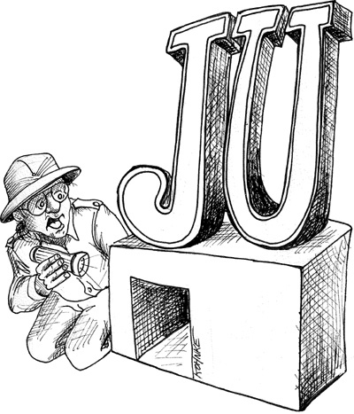

这里是《Clean Code》（代码整洁之道）第 15 章 "JUnit Internals" 的中英对照翻译。

---

### 总结 (Summary)

本章通过分析 JUnit 框架中的 `ComparisonCompactor` 类，展示了如何对即便是由顶尖程序员（Kent Beck 和 Eric Gamma）编写的高质量代码进行重构。作者罗伯特·马丁（Uncle Bob）强调了“童子军军规”（Boy Scout Rule）——即让代码比你发现时更整洁。

本章通过一系列迭代步骤，演示了如何：
1.  **清理变量命名**：移除过时的成员变量前缀。
2.  **封装条件逻辑**：让代码意图更清晰。
3.  **消除时序耦合**：处理函数调用的依赖顺序问题。
4.  **区分分析与合成**：将计算逻辑与字符串构建逻辑分离。
5.  **迭代重构**：重构是一个试错的过程，有时需要推翻之前的改动以达到最佳效果。

### 小计 (Key Points)

*   **没有代码是完美的**：即使是像 JUnit 这样优秀的框架，其内部代码也有改进空间。
*   **时序耦合（Temporal Coupling）**：如果函数 B 必须在函数 A 之后调用，这种依赖关系应该在代码结构中显式体现，而不是隐含在调用顺序中。
*   **命名的一致性**：索引（index）和长度（length）的概念容易混淆，清晰的命名和逻辑（如避免莫名其妙的 +1/-1）至关重要。
*   **重构的本质**：重构不仅仅是清理代码，更是为了理清逻辑结构（如拓扑排序），让代码读起来像文章一样流畅。

---

# 第 15 章 JUnit Internals (JUnit 内幕)



JUnit is one of the most famous of all Java frameworks. As frameworks go, it is simple in conception, precise in definition, and elegant in implementation. But what does the code look like? In this chapter we’ll critique an example drawn from the JUnit framework.
JUnit 是所有 Java 框架中最著名的之一。就框架而言，它概念简单、定义精确且实现优雅。但它的代码长什么样呢？在本章中，我们将剖析一个取自 JUnit 框架的例子。

## THE JUNIT FRAMEWORK (JUnit 框架)

JUnit has had many authors, but it began with Kent Beck and Eric Gamma together on a plane to Atlanta. Kent wanted to learn Java, and Eric wanted to learn about Kent’s Smalltalk testing framework. “What could be more natural to a couple of geeks in cramped quarters than to pull out our laptops and start coding?”1 After three hours of high-altitude work, they had written the basics of JUnit.
JUnit 有过许多作者，但它始于 Kent Beck 和 Eric Gamma 一起去亚特兰大的飞机上。Kent 想学 Java，而 Eric 想了解 Kent 的 Smalltalk 测试框架。“对于挤在狭窄空间里的两个极客来说，还有什么比拿出笔记本电脑开始写代码更自然的事呢？”[1] 经过三小时的高空作业，他们写出了 JUnit 的基础。

> 1. JUnit Pocket Guide, Kent Beck, O’Reilly, 2004, p. 43.

The module we’ll look at is the clever bit of code that helps identify string comparison errors. This module is called ComparisonCompactor. Given two strings that differ, such as ABCDE and ABXDE, it will expose the difference by generating a string such as <…B[X]D…>.
我们要看的模块是一段巧妙的代码，用于帮助识别字符串比较错误。这个模块叫做 `ComparisonCompactor`。给定两个不同的字符串，例如 `ABCDE` 和 `ABXDE`，它会生成一个类似 `<…B[X]D…>` 的字符串来以此展示差异。

I could explain it further, but the test cases do a better job. So take a look at Listing 15-1 and you will understand the requirements of this module in depth. While you are at it, critique the structure of the tests. Could they be simpler or more obvious?
我可以进一步解释，但测试用例能更好地说明问题。所以，请看代码清单 15-1，你会深入了解这个模块的需求。在阅读的同时，不妨评判一下这些测试的结构。它们能更简单或更直观吗？

**Listing 15-1 ComparisonCompactorTest.java**
```java
   package junit.tests.framework;
   import junit.framework.ComparisonCompactor;
   import junit.framework.TestCase;
 
   public class ComparisonCompactorTest extends TestCase {
 
     public void testMessage() {
       String failure= new ComparisonCompactor(0, “b”, “c”).compact(“a”);
       assertTrue(“a expected:<[b]> but was:<[c]>”.equals(failure));
     }
 
     public void testStartSame() {
       String failure= new ComparisonCompactor(1, “ba”, “bc”).compact(null);
       assertEquals(“expected:<b[a]> but was:<b[c]>”, failure);
     }
 
     public void testEndSame() {
       String failure= new ComparisonCompactor(1, “ab”, “cb”).compact(null);
       assertEquals(“expected:<[a]b> but was:<[c]b>”, failure);
     }
 
     public void testSame() {
       String failure= new ComparisonCompactor(1, “ab”, “ab”).compact(null);
       assertEquals(“expected:<ab> but was:<ab>”, failure);
     }
 
     public void testNoContextStartAndEndSame() {
       String failure= new ComparisonCompactor(0, “abc”, “adc”).compact(null);
       assertEquals(“expected:<…[b]…> but was:<…[d]…>”, failure);
     }
     public void testStartAndEndContext() {
       String failure= new ComparisonCompactor(1, “abc”, “adc”).compact(null);
       assertEquals(“expected:<a[b]c> but was:<a[d]c>”, failure);
     }
  
     public void testStartAndEndContextWithEllipses() {
       String failure= 
    new ComparisonCompactor(1, “abcde”, “abfde”).compact(null);
       assertEquals(“expected:<…b[c]d…> but was:<…b[f]d…>”, failure);
     }
 
     public void testComparisonErrorStartSameComplete() {
       String failure= new ComparisonCompactor(2, “ab”, “abc”).compact(null);
       assertEquals(“expected:<ab[]> but was:<ab[c]>”, failure);
     }
 
     public void testComparisonErrorEndSameComplete() {
       String failure= new ComparisonCompactor(0, “bc”, “abc”).compact(null);
       assertEquals(“expected:<[]…> but was:<[a]…>”, failure);
     }
 
     public void testComparisonErrorEndSameCompleteContext() {
       String failure= new ComparisonCompactor(2, “bc”, “abc”).compact(null);
       assertEquals(“expected:<[]bc> but was:<[a]bc>”, failure);
     }
 
     public void testComparisonErrorOverlapingMatches() {
       String failure= new ComparisonCompactor(0, “abc”, “abbc”).compact(null);
       assertEquals(“expected:<…[]…> but was:<…[b]…>”, failure);
   }
 
     public void testComparisonErrorOverlapingMatchesContext() {
       String failure= new ComparisonCompactor(2, “abc”, “abbc”).compact(null);
       assertEquals(“expected:<ab[]c> but was:<ab[b]c>”, failure);
     }
 
     public void testComparisonErrorOverlapingMatches2() {
       String failure= new ComparisonCompactor(0, “abcdde”,
“abcde”).compact(null);
       assertEquals(“expected:<…[d]…> but was:<…[]…>”, failure);
     }
     public void testComparisonErrorOverlapingMatches2Context() {
       String failure= 
      new ComparisonCompactor(2, “abcdde”, “abcde”).compact(null);
       assertEquals(“expected:<…cd[d]e> but was:<…cd[]e>”, failure);
     }
 
     public void testComparisonErrorWithActualNull() {
       String failure= new ComparisonCompactor(0, “a”, null).compact(null);
       assertEquals(“expected:<a> but was:<null>”, failure);
     }
  
     public void testComparisonErrorWithActualNullContext() {
       String failure= new ComparisonCompactor(2, “a”, null).compact(null);
       assertEquals(“expected:<a> but was:<null>”, failure);
    }
 
    public void testComparisonErrorWithExpectedNull() {
      String failure= new ComparisonCompactor(0, null, “a”).compact(null);
      assertEquals(“expected:<null> but was:<a>”, failure);
    }
 
    public void testComparisonErrorWithExpectedNullContext() {
      String failure= new ComparisonCompactor(2, null, “a”).compact(null);
      assertEquals(“expected:<null> but was:<a>”, failure);
    }
    public void testBug609972() {
      String failure= new ComparisonCompactor(10, “S&P500”, “0”).compact(null);
      assertEquals(“expected:<[S&P50]0> but was:<[]0>”, failure);
    }
   }
```

I ran a code coverage analysis on the ComparisonCompactor using these tests. The code is 100 percent covered. Every line of code, every if statement and for loop, is executed by the tests. This gives me a high degree of confidence that the code works and a high degree of respect for the craftsmanship of the authors.
我使用这些测试对 `ComparisonCompactor` 进行了代码覆盖率分析。代码覆盖率达到了 100%。每一行代码、每一个 if 语句和 for 循环都被测试执行到了。这让我对代码的运行充满信心，也对作者的技艺充满敬意。

The code for ComparisonCompactor is in Listing 15-2. Take a moment to look over this code. I think you’ll find it to be nicely partitioned, reasonably expressive, and simple in structure. Once you are done, then we’ll pick the nits together.
`ComparisonCompactor` 的代码见代码清单 15-2。花点时间看看这段代码。我想你会发现它划分得很好，表达也算清晰，结构也很简单。看完了之后，我们再一起来给它“挑挑刺”。

**Listing 15-2 ComparisonCompactor.java (Original)**
```java
   package junit.framework;
 
   public class ComparisonCompactor {
 
     private static final String ELLIPSIS = “…”;
     private static final String DELTA_END = “]”;
     private static final String DELTA_START = “[”;
 
     private int fContextLength;
     private String fExpected;
     private String fActual;
     private int fPrefix;
     private int fSuffix;
 
     public ComparisonCompactor(int contextLength,
                                String expected,
                                  String actual) {
       fContextLength = contextLength;
       fExpected = expected;
       fActual = actual;
     }
 
     public String compact(String message) {
       if (fExpected == null || fActual == null || areStringsEqual())
         return Assert.format(message, fExpected, fActual);

       findCommonPrefix();
       findCommonSuffix();
       String expected = compactString(fExpected);
       String actual = compactString(fActual);
       return Assert.format(message, expected, actual);
     }
 
     private String compactString(String source) {
       String result = DELTA_START + 
                         source.substring(fPrefix, source.length() - fSuffix + 1) + DELTA_END;
       if (fPrefix > 0)
         result = computeCommonPrefix() + result;
       if (fSuffix > 0)
         result = result + computeCommonSuffix();
       return result;
   }
   private void findCommonPrefix() {
     fPrefix = 0;
     int end = Math.min(fExpected.length(), fActual.length());
     for (; fPrefix < end; fPrefix++) {
       if (fExpected.charAt(fPrefix) != fActual.charAt(fPrefix))
         break;
     }
   }
 
   private void findCommonSuffix() {
     int expectedSuffix = fExpected.length() - 1;
     int actualSuffix = fActual.length() - 1;
     for (;
          actualSuffix >= fPrefix && expectedSuffix >= fPrefix;
           actualSuffix--, expectedSuffix--) {
       if (fExpected.charAt(expectedSuffix) != fActual.charAt(actualSuffix))
         break;
     }
     fSuffix = fExpected.length() - expectedSuffix;
   }
 
   private String computeCommonPrefix() {
     return (fPrefix > fContextLength ? ELLIPSIS : “”) +
              fExpected.substring(Math.max(0, fPrefix - fContextLength),
                                     fPrefix);
   }
   private String computeCommonSuffix() {
     int end = Math.min(fExpected.length() - fSuffix + 1 + fContextLength,
                          fExpected.length());
     return fExpected.substring(fExpected.length() - fSuffix + 1, end) +
            (fExpected.length() - fSuffix + 1 < fExpected.length() -  fContextLength ? ELLIPSIS : “”);
 
   }
 
   private boolean areStringsEqual() {
     return fExpected.equals(fActual);
   }
  }
```

You might have a few complaints about this module. There are some long expressions and some strange +1s and so forth. But overall this module is pretty good. After all, it might have looked like Listing 15-3.
你可能对这个模块有一些抱怨。比如有些表达式太长，还有些奇怪的 `+1` 等等。但总的来说，这个模块相当不错。毕竟，它本来可能写成代码清单 15-3 那样。

**Listing 15-3 ComparisonCompator.java (defactored)**
```java
   package junit.framework;
   public class  ComparisonCompactor {
     private int ctxt;
     private String s1;
     private String s2;
     private int pfx;
     private int sfx;
     public ComparisonCompactor(int ctxt, String s1, String s2) {
       this.ctxt = ctxt;
       this.s1 = s1;
       this.s2 = s2;
     }
 
     public String compact(String msg) {
       if (s1 == null || s2 == null || s1.equals(s2))
         return Assert.format(msg, s1, s2);
 
       pfx = 0;
       for (; pfx < Math.min(s1.length(), s2.length()); pfx++) {
         if (s1.charAt(pfx) != s2.charAt(pfx))
           break;
       }
       int sfx1 = s1.length() - 1;
       int sfx2 = s2.length() - 1;
       for (; sfx2 >= pfx && sfx1 >= pfx; sfx2--, sfx1--) {
         if (s1.charAt(sfx1) != s2.charAt(sfx2))
         break;
     }
       sfx = s1.length() - sfx1;
       String cmp1 = compactString(s1);
       String cmp2 = compactString(s2);
       return Assert.format(msg, cmp1, cmp2);
   }
   private String compactString(String s) {
     String result =
      “[“ + s.substring(pfx, s.length() - sfx + 1) + “]”;
     if (pfx > 0)
       result = (pfx > ctxt ? “…” : “”) +
         s1.substring(Math.max(0, pfx - ctxt), pfx) + result;
     if (sfx > 0) {
       int end = Math.min(s1.length() - sfx + 1 + ctxt, s1.length());
       result = result + (s1.substring(s1.length() - sfx + 1, end) +
         (s1.length() - sfx + 1 < s1.length() - ctxt ? “…” : “”));
     }
     return result;
    }
  }
```

Even though the authors left this module in very good shape, the Boy Scout Rule tells us we should leave it cleaner than we found it. So, how can we improve on the original code in Listing 15-2?
尽管作者留下的这个模块状态很好，但“童子军军规”[2] 告诉我们，我们离开时它应该比我们发现时更整洁。那么，我们如何改进代码清单 15-2 中的原始代码呢？

> 2. See “The Boy Scout Rule” on page 14.

The first thing I don’t care for is the f prefix for the member variables [N6]. Today’s environments make this kind of scope encoding redundant. So let’s eliminate all the f’s.
我不喜欢的第一件事是成员变量的 `f` 前缀 [N6]。现在的开发环境让这种作用域编码变得多余。所以让我们去掉所有的 `f`。

```java
   private int contextLength;
   private String expected;
   private String actual;
   private int prefix;
   private int suffix;
```

Next, we have an unencapsulated conditional at the beginning of the compact function [G28].
接下来，我们在 `compact` 函数的开头有一个未封装的条件判断 [G28]。

```java
   public String compact(String message) {
     if (expected == null || actual == null || areStringsEqual())
       return Assert.format(message, expected, actual);
     findCommonPrefix();
     findCommonSuffix();
     String expected = compactString(this.expected);
     String actual = compactString(this.actual);
     return Assert.format(message, expected, actual);
   }
```

This conditional should be encapsulated to make our intent clear. So let’s extract a method that explains it.
这个条件判断应该被封装起来，以便让我们的意图更清晰。所以让我们提取一个能解释它的方法。

```java
     public String compact(String message) {
       if (shouldNotCompact())
         return Assert.format(message, expected, actual);
       findCommonPrefix();
       findCommonSuffix();
       String expected = compactString(this.expected);
       String actual = compactString(this.actual);
       return Assert.format(message, expected, actual);
     }
private boolean shouldNotCompact() {
       return expected == null || actual == null || areStringsEqual();
     }
```

I don’t much care for the this.expected and this.actual notation in the compact function. This happened when we changed the name of fExpected to expected. Why are there variables in this function that have the same names as the member variables? Don’t they represent something else [N4]? We should make the names unambiguous.
我不太喜欢 `compact` 函数中 `this.expected` 和 `this.actual` 的写法。这是因为我们将 `fExpected` 改名为 `expected` 后发生的。为什么这个函数里会有和成员变量同名的变量呢？它们难道不是代表别的东西吗 [N4]？我们应该让名字不再模棱两可。

```java
   String compactExpected = compactString(expected);
   String compactActual = compactString(actual);
```

Negatives are slightly harder to understand than positives [G29]. So let’s turn that if statement on its head and invert the sense of the conditional.
否定式比肯定式稍微难理解一些 [G29]。所以让我们把那个 if 语句颠倒过来，反转条件的含义。

```java
   public String compact(String message) {
     if (canBeCompacted()) {
       findCommonPrefix();
       findCommonSuffix();
       String compactExpected = compactString(expected);
       String compactActual = compactString(actual);
       return Assert.format(message, compactExpected, compactActual);
     } else {
       return Assert.format(message, expected, actual);
     }
   }
   private boolean canBeCompacted() {
     return expected != null && actual != null && ! areStringsEqual();
   }
```

The name of the function is strange [N7]. Although it does compact the strings, it actually might not compact the strings if canBeCompacted returns false. So naming this function compact hides the side effect of the error check. Notice also that the function returns a formatted message, not just the compacted strings. So the name of the function should really be formatCompactedComparison. That makes it read a lot better when taken with the function argument:
这个函数的名字有点奇怪 [N7]。虽然它确实压缩了字符串，但如果 `canBeCompacted` 返回 false，它实际上可能不会压缩字符串。所以把这个函数命名为 `compact` 隐藏了错误检查的副作用。另外注意，这个函数返回的是格式化后的消息，而不仅仅是压缩后的字符串。所以这个函数的名字实际上应该是 `formatCompactedComparison`（格式化压缩后的比较）。这样配合函数参数读起来会好很多：

```java
   public String formatCompactedComparison(String message) {
```

The body of the if statement is where the true compacting of the expected and actual strings is done. We should extract that as a method named compactExpectedAndActual. However, we want the formatCompactedComparison function to do all the formatting. The compact… function should do nothing but compacting [G30]. So let’s split it up as follows:
if 语句的主体才是真正对 expected 和 actual 字符串进行压缩的地方。我们应该将其提取为一个名为 `compactExpectedAndActual` 的方法。然而，我们希望 `formatCompactedComparison` 函数来完成所有的格式化工作。`compact...` 函数应该只做压缩工作，不做其他事 [G30]。所以让我们按照如下方式拆分：

```java
  …
    private String compactExpected;
    private String compactActual; 
  …
    public String formatCompactedComparison(String message) {
      if (canBeCompacted()) {
        compactExpectedAndActual();
        return Assert.format(message, compactExpected, compactActual);
      } else { 

        return Assert.format(message, expected, actual);
      }
    }
    private void compactExpectedAndActual() {
      findCommonPrefix();
      findCommonSuffix();
      compactExpected = compactString(expected);
      compactActual = compactString(actual);
    }
```

Notice that this required us to promote compactExpected and compactActual to member variables. I don’t like the way that the last two lines of the new function return variables, but the first two don’t. They aren’t using consistent conventions [G11]. So we should change findCommonPrefix and findCommonSuffix to return the prefix and suffix values.
注意，这要求我们将 `compactExpected` 和 `compactActual` 提升为成员变量。我不喜欢新函数最后两行返回变量，而前两行却没有的做法。它们没有使用一致的约定 [G11]。所以我们应该更改 `findCommonPrefix` 和 `findCommonSuffix`，让它们返回前缀和后缀的值。

```java
  private void compactExpectedAndActual() {
    prefixIndex = findCommonPrefix();
    suffixIndex = findCommonSuffix();
    compactExpected = compactString(expected);
    compactActual = compactString(actual);
  }
  private int findCommonPrefix() {
    int prefixIndex = 0;
    int end = Math.min(expected.length(), actual.length());
    for (; prefixIndex < end; prefixIndex++) {
      if (expected.charAt(prefixIndex) != actual.charAt(prefixIndex))
        break;
    }
    return prefixIndex;
  }
  private int findCommonSuffix() {  
    int expectedSuffix = expected.length() - 1;
    int actualSuffix = actual.length() - 1;
    for (; actualSuffix >= prefixIndex && expectedSuffix >= prefixIndex;
         actualSuffix--, expectedSuffix--) {
      if (expected.charAt(expectedSuffix) != actual.charAt(actualSuffix))
        break;
    }
    return expected.length() - expectedSuffix;
  }
```

We should also change the names of the member variables to be a little more accurate [N1]; after all, they are both indices.
我们也应该更改成员变量的名字，使其更准确一点 [N1]；毕竟，它们都是索引（index）。

Careful inspection of findCommonSuffix exposes a hidden temporal coupling [G31]; it depends on the fact that prefixIndex is calculated by findCommonPrefix. If these two functions were called out of order, there would be a difficult debugging session ahead. So, to expose this temporal coupling, let’s have findCommonSuffix take the prefixIndex as an argument.
仔细检查 `findCommonSuffix` 会发现一个隐藏的**时序耦合（temporal coupling）** [G31]；它依赖于 `prefixIndex` 是由 `findCommonPrefix` 计算出来的这一事实。如果这两个函数调用的顺序错了，前面就会有一场艰难的调试在等着。所以，为了暴露这种时序耦合，我们让 `findCommonSuffix` 接收 `prefixIndex` 作为参数。

```java
   private void compactExpectedAndActual() {
     prefixIndex = findCommonPrefix();
     suffixIndex = findCommonSuffix(prefixIndex);
     compactExpected = compactString(expected);
     compactActual = compactString(actual);
   }
   private int findCommonSuffix(int prefixIndex) {
     int expectedSuffix = expected.length() - 1;
     int actualSuffix = actual.length() - 1;
     for (; actualSuffix >= prefixIndex && expectedSuffix >= prefixIndex;
          actualSuffix--, expectedSuffix--) {
       if (expected.charAt(expectedSuffix) != actual.charAt(actualSuffix))
         break;
     }
     return expected.length() - expectedSuffix;
   }
```

I’m not really happy with this. The passing of the prefixIndex argument is a bit arbitrary [G32]. It works to establish the ordering but does nothing to explain the need for that ordering. Another programmer might undo what we have done because there’s no indication that the parameter is really needed. So let’s take a different tack.
我对此并不太满意。传递 `prefixIndex` 参数有点随意 [G32]。它确实起到了确立顺序的作用，但并没有解释为什么需要这种顺序。另一个程序员可能会撤销我们所做的，因为没有迹象表明这个参数真的是必须的。所以我们换种策略。

```java
   private void compactExpectedAndActual() {
     findCommonPrefixAndSuffix();
     compactExpected = compactString(expected);
     compactActual = compactString(actual);
   }
   private void findCommonPrefixAndSuffix() {
     findCommonPrefix();
     int expectedSuffix = expected.length() - 1;
     int actualSuffix = actual.length() - 1;
     for (;
          actualSuffix >= prefixIndex && expectedSuffix >= prefixIndex;
          actualSuffix--, expectedSuffix-- 
       )  {
 
       if (expected.charAt(expectedSuffix) != actual.charAt(actualSuffix))
         break;
     }
     suffixIndex = expected.length() - expectedSuffix;
   }
   private void findCommonPrefix() {
     prefixIndex = 0;
     int end = Math.min(expected.length(), actual.length());
     for (;   prefixIndex < end; prefixIndex++)
       if (expected.charAt(prefixIndex) != actual.charAt(prefixIndex))
         break;
   }
```

We put findCommonPrefix and findCommonSuffix back the way they were, changing the name of findCommonSuffix to findCommonPrefixAnd Suffix and having it call findCommon-Prefix before doing anything else. That establishes the temporal nature of the two functions in a much more dramatic way than the previous solution. It also points out how ugly findCommonPrefixAndSuffix is. Let’s clean it up now.
我们将 `findCommonPrefix` 和 `findCommonSuffix` 恢复原样，将 `findCommonSuffix` 改名为 `findCommonPrefixAndSuffix`，并让它在做任何其他事情之前先调用 `findCommonPrefix`。这比之前的方案更显著地确立了这两个函数的时序特性。这同时也指出了 `findCommonPrefixAndSuffix` 有多丑陋。现在让我们来清理它。

```java
   private void findCommonPrefixAndSuffix() {
     findCommonPrefix();
     int suffixLength = 1; 
     for (; !suffixOverlapsPrefix(suffixLength); suffixLength++) {
       if (charFromEnd(expected, suffixLength) !=
            charFromEnd(actual, suffixLength))
         break;
     }
     suffixIndex = suffixLength;
   }
   private char charFromEnd(String s, int i) {
     return s.charAt(s.length()-i);}
   private boolean suffixOverlapsPrefix(int suffixLength) {
     return actual.length() - suffixLength < prefixLength ||
       expected.length() - suffixLength < prefixLength;
   }
```

This is much better. It exposes that the suffixIndex is really the length of the suffix and is not well named. The same is true of the prefixIndex, though in that case “index” and “length” are synonymous. Even so, it is more consistent to use “length.” The problem is that the suffixIndex variable is not zero based; it is 1 based and so is not a true length. This is also the reason that there are all those +1s in computeCommonSuffix [G33]. So let’s fix that. The result is in Listing 15-4.
这好多了。它暴露了 `suffixIndex` 实际上是后缀的长度，名字起得不好。`prefixIndex` 也是如此，虽然在这种情况下，“索引”和“长度”是同义的。即便如此，使用“长度”也更一致。问题在于 `suffixIndex` 变量不是从 0 开始的；它是从 1 开始的，所以不是真正的长度。这也是为什么 `computeCommonSuffix` 中会有那些 `+1` 的原因 [G33]。所以让我们修复它。结果见代码清单 15-4。

**Listing 15-4 ComparisonCompactor.java (interim)**
```java
   public class ComparisonCompactor {
   …
     private int suffixLength;
   …
     private void findCommonPrefixAndSuffix() {
       findCommonPrefix();
       suffixLength = 0;
       for (; !suffixOverlapsPrefix(suffixLength); suffixLength++) {
         if (charFromEnd(expected, suffixLength) !=
             charFromEnd(actual, suffixLength))
           break;
       }
    }
    private char charFromEnd(String s, int i) {
      return s.charAt(s.length() - i - 1);
    }
    private boolean suffixOverlapsPrefix(int suffixLength) {
      return actual.length() - suffixLength <= prefixLength ||
        expected.length() - suffixLength <= prefixLength;
    }
 …
    private String compactString(String source) {
      String result =
        DELTA_START +
        source.substring(prefixLength, source.length() - suffixLength) +
        DELTA_END;
      if (prefixLength > 0)
        result = computeCommonPrefix() + result; 
      if (suffixLength > 0)
        result = result + computeCommonSuffix();
      return result;
    }
  …
    private String computeCommonSuffix() {
      int end = Math.min(expected.length() - suffixLength +
        contextLength, expected.length()
      );
      return
        expected.substring(expected.length() - suffixLength, end) +
        (expected.length() - suffixLength <
          expected.length() - contextLength ?
          ELLIPSIS : “”);
    }
```

We replaced the +1s in computeCommonSuffix with a -1 in charFromEnd, where it makes perfect sense, and two <= operators in suffixOverlapsPrefix, where they also make perfect sense. This allowed us to change the name of suffixIndex to suffixLength, greatly enhancing the readability of the code.
我们把 `computeCommonSuffix` 中的 `+1` 替换成了 `charFromEnd` 中的 `-1`（在这里它完全讲得通），以及 `suffixOverlapsPrefix` 中的两个 `<=` 运算符（同样讲得通）。这允许我们将 `suffixIndex` 改名为 `suffixLength`，大大增强了代码的可读性。

There is a problem however. As I was eliminating the +1s, I noticed the following line in compactString:
然而还有一个问题。当我在消除 `+1` 时，我注意到了 `compactString` 中的这一行：

```java
  if (suffixLength > 0)
```

Take a look at it in Listing 15-4. By rights, because suffixLength is now one less than it used to be, I should change the > operator to a >= operator. But that makes no sense. It makes sense now! This means that it didn’t use to make sense and was probably a bug. Well, not quite a bug. Upon further analysis we see that the if statement now prevents a zero length suffix from being appended. Before we made the change, the if statement was nonfunctional because suffixIndex could never be less than one!
在代码清单 15-4 中看看它。按理说，因为 `suffixLength` 现在比以前小了 1，我应该把 `>` 运算符改为 `>=` 运算符。但这讲不通。现在讲得通了！这意味着它以前讲不通，而且可能是一个 bug。嗯，不完全是 bug。经过进一步分析，我们发现这个 if 语句现在防止了追加长度为零的后缀。在我们修改之前，这个 if 语句是不起作用的，因为 `suffixIndex` 永远不可能小于 1！

This calls into question both if statements in compactString! It looks as though they could both be eliminated. So let’s comment them out and run the tests. They passed! So let’s restructure compactString to eliminate the extraneous if statements and make the function much simpler [G9].
这让人对 `compactString` 中的两个 if 语句都产生了怀疑！看起来它们都可以被消除。所以让我们把它们注释掉并运行测试。测试通过了！所以让我们重构 `compactString` 以消除多余的 if 语句，并使函数更简单 [G9]。

```java
   private String compactString(String source) {
       return
         computeCommonPrefix() +
         DELTA_START +
         source.substring(prefixLength, source.length() - suffixLength) +
         DELTA_END +
         computeCommonSuffix();
   }
```

This is much better! Now we see that the compactString function is simply composing the fragments together. We can probably make this even clearer. Indeed, there are lots of little cleanups we could do. But rather than drag you through the rest of the changes, I’ll just show you the result in Listing 15-5.
这好多了！现在我们看到 `compactString` 函数只是在将片段组合在一起。我们大概能让它更清晰。确实，我们还可以做很多小的清理工作。但与其拖着你看完剩下的改动，不如直接向你展示代码清单 15-5 中的结果。

**Listing 15-5 ComparisonCompactor.java (final)**
```java
   package junit.framework;
   public class ComparisonCompactor {
 
     private static final String ELLIPSIS = “…”;
     private static final String DELTA_END = “]”;
     private static final String DELTA_START = “[”;
     private int contextLength;
     private String expected;
     private String actual;
     private int prefixLength;
     private int suffixLength;
 
     public ComparisonCompactor(
       int contextLength, String expected, String actual
     ) {
       this.contextLength = contextLength;
       this.expected = expected;
       this.actual = actual;
     }
 
     public String formatCompactedComparison(String message) {
       String compactExpected = expected;
       String compactActual = actual;
       if (shouldBeCompacted()) {
         findCommonPrefixAndSuffix();
         compactExpected = compact(expected);
         compactActual = compact(actual);
      } 
      return Assert.format(message, compactExpected, compactActual);
    }
 
    private boolean shouldBeCompacted() {
      return !shouldNotBeCompacted();
    }
 
   private boolean shouldNotBeCompacted() {
     return expected == null ||
            actual == null ||
            expected.equals(actual);
   }
 
   private void findCommonPrefixAndSuffix() {
     findCommonPrefix();
     suffixLength = 0;
     for (; !suffixOverlapsPrefix(); suffixLength++) {
       if (charFromEnd(expected, suffixLength) !=
           charFromEnd(actual, suffixLength)
       )
 
         break;
      }
   }
   private char charFromEnd(String s, int i) {
     return s.charAt(s.length() - i - 1);
   }
   private boolean suffixOverlapsPrefix() {
     return actual.length() - suffixLength <= prefixLength ||
       expected.length() - suffixLength <= prefixLength;
   }
 
   private void findCommonPrefix() {
     prefixLength = 0;
     int end = Math.min(expected.length(), actual.length());
     for (; prefixLength < end; prefixLength++)
       if (expected.charAt(prefixLength) != actual.charAt(prefixLength))
         break;
   }
 
   private String compact(String s) {
     return new StringBuilder()
       .append(startingEllipsis())
       .append(startingContext())
       .append(DELTA_START)
       .append(delta(s))
       .append(DELTA_END)
       .append(endingContext())
       .append(endingEllipsis())
       .toString();
   }
   private String startingEllipsis() {
     return prefixLength > contextLength ? ELLIPSIS : “”;
   }
   private String startingContext() {
     int contextStart = Math.max(0, prefixLength - contextLength);
     int contextEnd = prefixLength;
     return expected.substring(contextStart, contextEnd);
   }
   private String delta(String s) {
     int deltaStart = prefixLength;
     int deltaEnd = s.length() - suffixLength;
     return s.substring(deltaStart, deltaEnd);
   }
   private String endingContext() {
     int contextStart = expected.length() - suffixLength;
     int contextEnd =
       Math.min(contextStart + contextLength, expected.length());
     return expected.substring(contextStart, contextEnd);
   }
   private String endingEllipsis() {
     return (suffixLength > contextLength ? ELLIPSIS : “”);
   }
  }
```

This is actually quite pretty. The module is separated into a group of analysis functions and another group of synthesis functions. They are topologically sorted so that the definition of each function appears just after it is used. All the analysis functions appear first, and all the synthesis functions appear last.
这实际上非常漂亮。这个模块被分成了一组分析函数和另一组合成函数。它们按**拓扑排序**（topologically sorted），以便每个函数的定义都紧跟在其被使用之后。所有的分析函数先出现，所有的合成函数最后出现。

If you look carefully, you will notice that I reversed several of the decisions I made earlier in this chapter. For example, I inlined some extracted methods back into formatCompactedComparison, and I changed the sense of the shouldNotBeCompacted expression. This is typical. Often one refactoring leads to another that leads to the undoing of the first. Refactoring is an iterative process full of trial and error, inevitably converging on something that we feel is worthy of a professional.
如果你仔细观察，你会发现我推翻了本章早些时候做出的几个决定。例如，我将一些提取的方法内联回了 `formatCompactedComparison`，并且我更改了 `shouldNotBeCompacted` 表达式的含义。这很典型。通常一个重构会导致另一个重构，进而导致撤销第一个重构。重构是一个充满试错的迭代过程，最终不可避免地汇聚成我们认为配得上专业水准的代码。

## CONCLUSION (结论)

And so we have satisfied the Boy Scout Rule. We have left this module a bit cleaner than we found it. Not that it wasn’t clean already. The authors had done an excellent job with it. But no module is immune from improvement, and each of us has the responsibility to leave the code a little better than we found it.
至此，我们已经遵守了童子军军规。我们让这个模块比我们发现时更整洁了一点。并不是说它原来不整洁。作者们已经做得非常出色了。但没有哪个模块是可以免于改进的，我们每个人都有责任让代码比我们发现时好一点点。